# Global VPC — 工程圖解與講稿

適用對象：平台／網路工程師與技術主管。這份圖集描述 v0.1.0 managed v1alpha2 實作、通用範例與驗收方法，不包含任何私人環境描述。

建議完整講解約 35–45 分鐘：01–02 說明體驗與責任；03–05 說明部署、discovery 與 Kube-OVN；06–09 說明流量、選項、隔離與 HA；10–12 說明操作與成熟度。技術主管快速版可先看 01、02、06、09、12，約 12 分鐘。

圖片內的 site / location 對應一個獨立 Infra/DC。Public VPC 是全域意圖；native Vpc 是每個 Infra 中的 Kube-OVN 物件。所有操作命令以 [managed quick start](../managed-quickstart.md) 為準；圖中名稱、位址與拓樸均為通用範例。

## 01 · 使用者描述網路，平台完成跨站連線

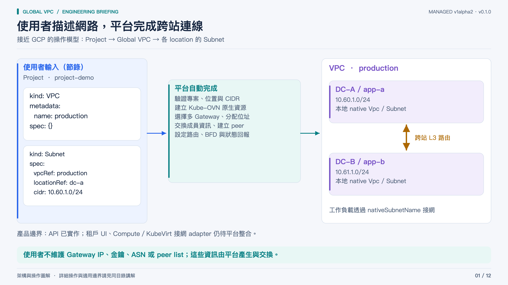

**一句話：** 使用者不維護 Gateway IP、金鑰、ASN 或 peer list；這些資訊由平台產生與交換。

**講解順序：**

1. 先從使用者視角介紹：在 project namespace 建立一個 VPC，再為 dc-a、dc-b 建立 Subnet。VPC 名稱與預設 class 就足以建立全域意圖；子網只需 vpcRef、locationRef、cidr。
2. 此處的 global 是路由與資源管理範圍；一個 Subnet 仍只屬於一個 Infra/DC，並非跨站延伸 L2，也不宣稱具備完整 GCP 產品能力。
3. 單站只有本地子網時，建立原生 Kube-OVN Vpc/Subnet，不啟動跨站 Gateway；有遠端子網後才配置 Gateway 與跨站路由。
4. Compute 平台仍需實作 nativeSubnetName 查詢與 Pod/VM 接網介面。圖中的使用者體驗是已實作 API 的入口；租戶 UI 與 compute adapter 尚未實作。

**來源：** [docs/managed-quickstart.md](../../docs/managed-quickstart.md) · [api/v1alpha2/types.go](../../api/v1alpha2/types.go) · [internal/platformcontroller](../../internal/platformcontroller)

[4K PNG](01-platform-experience.png) · [可編輯 SVG](01-platform-experience.svg)

## 02 · 集中管理意圖，各 site 自主執行

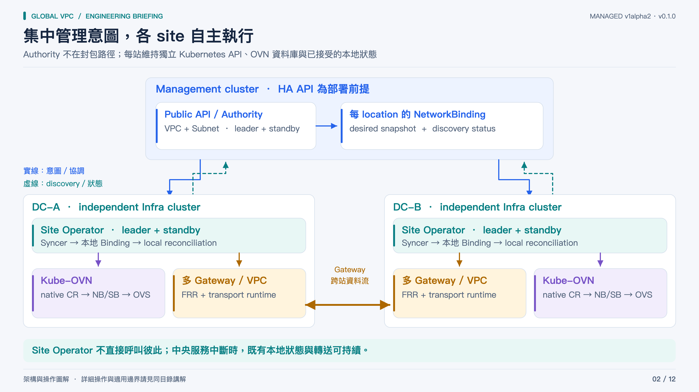

**一句話：** Site Operator 不直接呼叫彼此；中央服務中斷時，既有本地狀態與轉送可持續。

**講解順序：**

1. Authority 讀取 public VPC/Subnet，驗證與配置全域資源，為各 location 產生 NetworkBinding。管理叢集 API 同時保存意圖與交換所需資訊。
2. 每站 Site Operator 從自己的 authority namespace 取回 Binding，保存到本地 API，再協調 Kube-OVN 原生資源與 Gateway runtime。虛線表示狀態回報，而非封包路徑。
3. Authority 與各站 operator 都是兩副本、Lease leader election；同一責任範圍只有 leader 執行。兩副本 Deployment 並不代表 management etcd 跨站災難恢復已完成。
4. 各站的 operator 不建立直接 RPC mesh；但 Gateway runtime 仍然需要對端 Gateway 的 endpoints、路由與協定會話。失去中央 API 時既有 dataplane 可繼續，新跨站意圖與成員資訊更新會等待恢復。

**來源：** [cmd/platform-vpc-controller/main.go](../../cmd/platform-vpc-controller/main.go) · [internal/localcontroller/sync.go](../../internal/localcontroller/sync.go) · [config/managed/authority.yaml](../../config/managed/authority.yaml) · [config/managed/site.yaml](../../config/managed/site.yaml)

[4K PNG](02-component-architecture.png) · [可編輯 SVG](02-component-architecture.svg)

## 03 · 安裝分成平台一次性設定與使用者建網

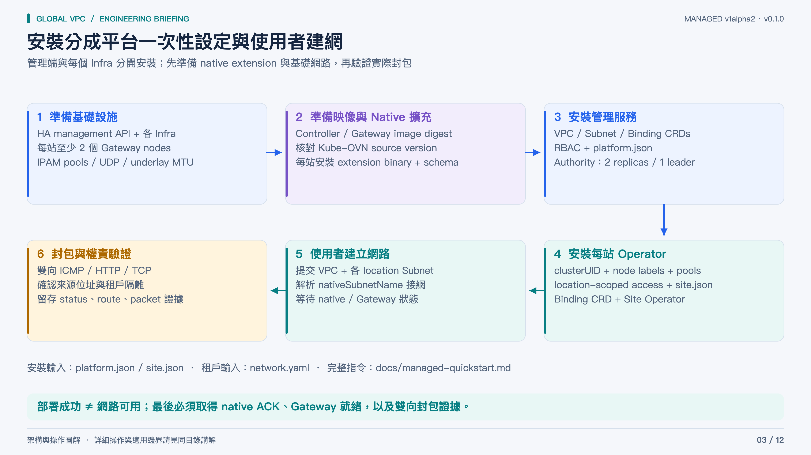

**一句話：** 部署成功 ≠ 網路可用；最後必須取得 native ACK、Gateway 就緒，以及雙向封包證據。

**講解順序：**

1. 平台管理者先確認 HA management API、各 Infra API、至少兩個可選 Gateway node、跨站可路由的 endpoint、Linux transport 能力、UDP 放行與 MTU。IPAM/NetBox 的 parent pools 必須先保留，不能直接把範例位址當正式分配。
2. 建置 controller 與 gateway image 並使用 immutable digest。跨站必須準備和既有 Kube-OVN controller source 相符的 destination-routes.v1 extension，以及相應 CRD schema；只有套 schema 不足以完成安裝。
3. 管理端套 public/internal CRD、RBAC、platform.json 與 Authority。每站記錄 clusterUID、標記 Gateway node，安裝 internal Binding CRD、site.json、location-scoped access 與 Site Operator。完整可執行步驟在 managed-quickstart.md。
4. 開發 bootstrap helper 提供約一小時 access token；正式平台應接可更新的身分。這個原型沒有自動 token renewal，過期會停止管理同步，並不撤回已接受的本地 dataplane。
5. 使用者提交 network.yaml 後，等待 VPC Ready，查詢 Subnet.status.nativeSubnetName，依 quickstart 建立 smoke Pods 並跑雙向 ping/wget。此圖是安裝順序，不能取代版本核對與實際參數。

**來源：** [docs/managed-quickstart.md](../../docs/managed-quickstart.md) · [config/examples/managed](../../config/examples/managed) · [config/managed](../../config/managed) · [integration/kube-ovn/README.md](../../integration/kube-ovn/README.md)

[4K PNG](03-installation-flow.png) · [可編輯 SVG](03-installation-flow.svg)

## 04 · Gateway discovery 使用既有 Kubernetes API

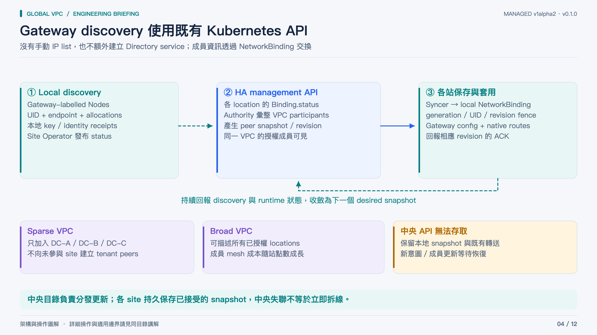

**一句話：** 中央目錄負責分發更新；各 site 持久保存已接受的 snapshot，中央失聯不等於立即拆線。

**講解順序：**

1. 站點 operator 以 Gateway node selector 讀取 Nodes，驗證 UID 與 endpoint，配置本地位址與 transport 需要的識別。WireGuard 私鑰只存放本地 immutable Secret；回報的是 public key 與可供對端使用的 discovery 資訊。
2. 本地 discovery/status 上傳該站在 management API 的 NetworkBinding。Authority 把已授權且參與同一個 VPC 的位置與成員組成 peer snapshot，分發給各站。這個邏輯目錄沿用 HA management API，沒有另一套目錄資料庫。
3. Syncer 保存本地 snapshot，驗證 source UID、revision 與 generation。單純 list omission 或 API 不通不會觸發刪除；撤除需要明確的 desired-state 刪除流程。
4. 加入很多 site 不需要人工維護 gateway IP，但 Gateway session/tunnel 數量仍增加。對稱每站 G 個 gateway、S 個參與站點時，完整跨站 member-pair 組合約為 S(S−1)G²/2；S=50、G=2 時約 4,900 對。這是拓撲估算，不等於每種 backend 的實際 interface 數或已測容量。
5. 只有少數 site 參與某 VPC 時，只交換該 VPC 的參與者。成員自動發現不代表硬體替換完全自動：node UID/endpoint 變更與 Gateway 數量變更仍被 fencing 保護，需管理者 recovery 流程。

**來源：** [internal/localcontroller/sync.go](../../internal/localcontroller/sync.go) · [internal/localcontroller/reconciler.go](../../internal/localcontroller/reconciler.go) · [internal/managedgateway/README.md](../../internal/managedgateway/README.md) · [internal/platformcontroller](../../internal/platformcontroller)

[4K PNG](04-automatic-discovery.png) · [可編輯 SVG](04-automatic-discovery.svg)

## 05 · Kube-OVN 維持原生網路設定的控制權

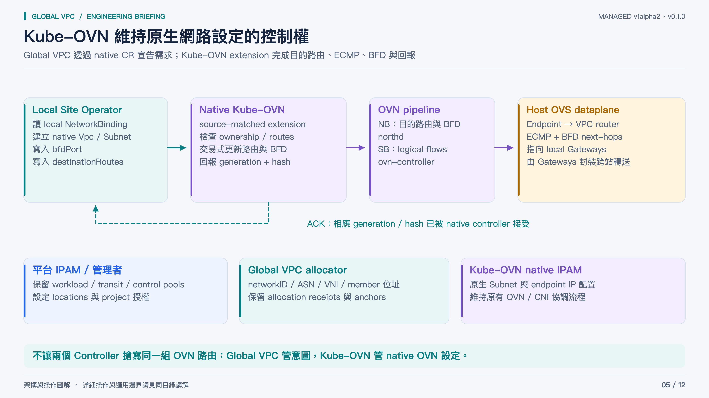

**一句話：** 不讓兩個 Controller 搶寫同一組 OVN 路由：Global VPC 管意圖，Kube-OVN 管 native OVN 設定。

**講解順序：**

1. 從左到右說明寫入權責：Site Operator 將 accepted Binding 轉成 native Vpc/Subnet，並設定 Vpc.spec.bfdPort、spec.destinationRoutes。native Kube-OVN controller 才是這些受管理目的路由的 NB 設定寫入者。
2. Kube-OVN 把路由與 BFD 在受 ownership fence 保護的交易中更新到 NB；northd 產生 SB 狀態，ovn-controller 配置各 host OVS。這裡的『單一 writer』指對 native 路由設定的責任，不是說 northd 等元件不寫自己的資料庫。
3. native extension 回報 destination-routes.v1 capability 與精確 generation/hash ACK。Local Operator 必須確認 ACK，再把相應狀態送回 Authority，不能只看到物件存在就宣告 Ready。
4. 上游 stock Kube-OVN 沒有此原型所需的完整 destinationRoutes contract。部署要同時提供 schema 與 source-matched controller binary。不同版本的 controller binary 與 schema 不能因名稱相近而視為可互換。
5. IPAM 分三層：平台管理 parent pool/位置授權；Global VPC 分配連線 infrastructure identities/addresses；原生 Kube-OVN 負責 Subnet 內 endpoint IPAM。此路徑不是 built-in OVN-IC 共享 transit switch 的架構。

**來源：** [integration/kube-ovn/README.md](../../integration/kube-ovn/README.md) · [internal/localcontroller/reconciler.go](../../internal/localcontroller/reconciler.go) · [internal/managedgateway/README.md](../../internal/managedgateway/README.md)

[4K PNG](05-kube-ovn-integration.png) · [可編輯 SVG](05-kube-ovn-integration.svg)

## 06 · 跨站封包走 Gateway，控制服務不在路徑上

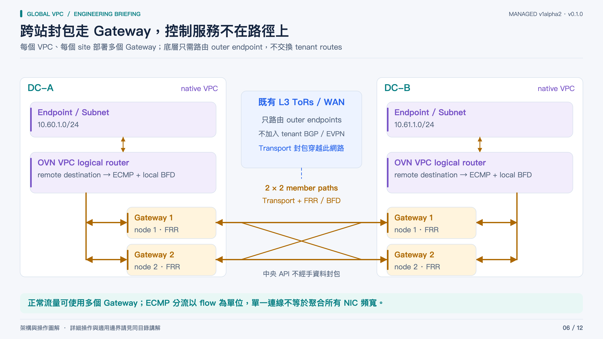

**一句話：** 正常流量可使用多個 Gateway；ECMP 分流以 flow 為單位，單一連線不等於聚合所有 NIC 頻寬。

**講解順序：**

1. 由左往右跟著一個封包走：A 的 endpoint 先進入本地 Kube-OVN VPC logical router；遠端目的前綴對應多個 Gateway next-hop，透過本地 BFD 健康狀態決定可用路徑。
2. Gateway 解讀租戶路由並透過選定 transport 封裝，outer source/destination 是可由既有 L3 underlay 路由的 Gateway node endpoints。B 端 Gateway 解封裝後再送回 B 的原生 VPC 與目的 endpoint。IPv4 路由設計保留 workload source address，部署時仍須用封包核對。
3. 圖中畫 2×2 個跨站成員組合，代表 G2 下可用的 member mesh。橘色資料路徑可雙向；不是說每個 packet 都複製到四條路，也不保證 forward/reverse 選到同一個 Gateway。
4. 本地 OVN→Gateway BFD 與 Gateway 間 FRR/BFD 觀測不同故障範圍。Authority、Site Operator、API 不在正常封包轉送鏈上，但依然負責新增意圖與恢復後的狀態收斂。
5. 不修改 ToR 指不要求增加 tenant VLAN/VNI、tenant route 或 EVPN/BGP peer；前提仍是 outer endpoints 可達、必要 UDP 可通與 MTU 足夠。NIC 線速加總不能直接當成有效吞吐量。

**來源：** [gateway/managed.py](../../gateway/managed.py) · [internal/managedgateway/README.md](../../internal/managedgateway/README.md) · [integration/kube-ovn/README.md](../../integration/kube-ovn/README.md) · [docs/managed-validation.md](../../docs/managed-validation.md)

[4K PNG](06-packet-path.png) · [可編輯 SVG](06-packet-path.svg)

## 07 · 三種 Transport，共用同一個平台 API

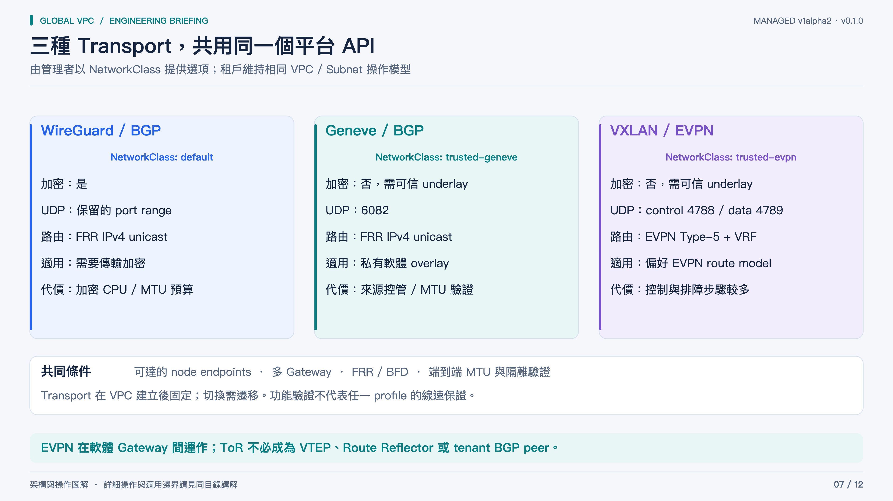

**一句話：** EVPN 在軟體 Gateway 間運作；ToR 不必成為 VTEP、Route Reflector 或 tenant BGP peer。

**講解順序：**

1. WireGuard/BGP 提供加密 transport，使用管理者保留的 UDP port range；安全性更直觀，但 CPU、加密吞吐與 MTU 必須依實際硬體量測。
2. Geneve/BGP 使用 native Geneve UDP 6082，適合可信的私有 underlay；不提供 WireGuard 的傳輸加密。6081 留給既有 Kube-OVN OVS Geneve，避免占用相同 port。
3. VXLAN/EVPN 使用控制 overlay UDP 4788 與 VXLAN data UDP 4789，Gateway FRR 以 EVPN Type-5 搭配 tenant VRF/L3VNI。底層網路只處理 outer IP，無須讓 ToR 加入租戶 EVPN。這個選項控制/資料模型較多，排障也更複雜。
4. 目前 gateway 控制會話跨站採 eBGP，站內 sibling 路徑有 iBGP；ASN 由平台配置，使用者不用填。此部署選擇不表示所有 Global VPC 設計必須採 eBGP。
5. 三種 profile 都需要獨立的封包與故障驗證，不能從低負載功能測試推導硬體 capacity。現有 VPC 的 transport 不能原地切換，需建立新 VPC 規劃遷移。

**來源：** [config/examples/managed/platform.json](../../config/examples/managed/platform.json) · [docs/managed-quickstart.md](../../docs/managed-quickstart.md) · [gateway/managed.py](../../gateway/managed.py) · [gateway/evpn.py](../../gateway/evpn.py) · [gateway/overlay.py](../../gateway/overlay.py)

[4K PNG](07-transport-options.png) · [可編輯 SVG](07-transport-options.svg)

## 08 · CIDR 可以重疊，租戶的路由識別不能混在一起

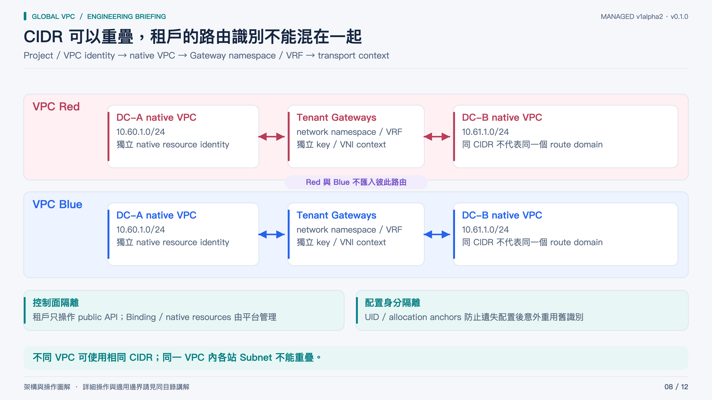

**一句話：** 不同 VPC 可使用相同 CIDR；同一 VPC 內各站 Subnet 不能重疊。

**講解順序：**

1. 用 Red、Blue 兩個租戶說明：它們在各自 A 站與 B 站使用相同 CIDR，但 native VPC、Gateway runtime/network namespace、transport context 都是隔離的。傳送時不能只憑 destination IP 決定 tenant。
2. WireGuard 依租戶/成員的 key 與路由配置；Geneve 用對應 VNI 與 source delegation；EVPN 使用 tenant VRF/L3VNI 與路由匯入範圍。圖將 backend 差異抽象成 transport context，實際識別請查各 backend 原始碼。
3. 同一 VPC 內的 prefixes 必須可唯一路由，因此跨位置 Subnet 不能重疊。Authority 負責 prefix admission 與全域 identity 配置，local registry 保存分配與不可變 anchor。
4. Tenant 只應有 public VPC/Subnet 編輯權。NetworkBinding、operator namespace、native CR 與 status 屬平台內部，不能把這些寫入權限開給租戶。
5. 隔離驗證應包含 receiver-side capture，確認禁止的封包沒有到達。此控制器尚未提供完整租戶 Firewall policy/UI，也不能把有限測試視為安全認證。

**來源：** [internal/platformplan](../../internal/platformplan) · [internal/managedgateway/README.md](../../internal/managedgateway/README.md) · [gateway/managed.py](../../gateway/managed.py) · [docs/managed-validation.md](../../docs/managed-validation.md)

[4K PNG](08-tenant-isolation.png) · [可編輯 SVG](08-tenant-isolation.svg)

## 09 · HA 保住可用路徑，也明確處理所有路徑失效

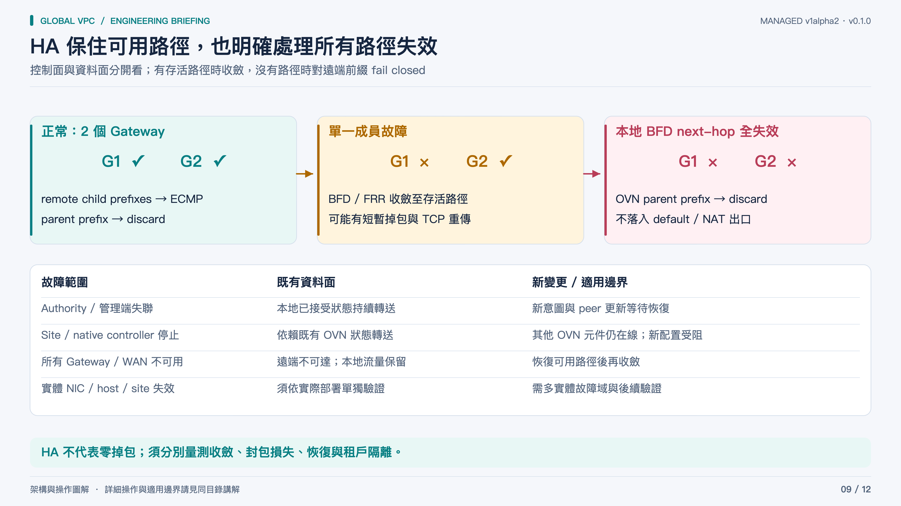

**一句話：** HA 不代表零掉包；須分別量測收斂、封包損失、恢復與租戶隔離。

**講解順序：**

1. 正常時 remote parent prefix 拆成兩個更精確的 child prefixes，各 child 對應多個 BFD-protected Gateway next-hops，parent 保持 discard。健康路徑以最長前綴優先；所有 child next-hop down 時落到 parent discard。每個目的前綴是 2×N+1 條 native static routes。
2. 單一 Gateway full/WAN/OVN path 故障時，本地與 gateway FRR/BFD 讓流量朝存活路徑收斂。應分別量測 held TCP、新建 TCP、UDP 與更新期間的錯誤，不預設 zero-loss failover。
3. Authority/Site Operator/native controller 停止與 OVN DB、northd、host dataplane 故障是不同範圍。控制程序停止的驗證不能當作 site 斷電或實體 NIC 故障的證據。
4. 所有 WAN 路徑中斷時遠端不可達，仍須核對本地與其他租戶是否正常。all-local-BFD-down 驗收必須確認遠端目的不會因 default/NAT route 而洩漏。
5. Management API HA/etcd quorum 是部署前提與獨立設計工作。Gateways 分布到不同實體 host 才能建立硬體故障域隔離；模擬的多節點拓樸不能取代實體故障域驗證。

**來源：** [integration/kube-ovn/README.md](../../integration/kube-ovn/README.md) · [docs/managed-validation.md](../../docs/managed-validation.md)

[4K PNG](09-ha-failure-behavior.png) · [可編輯 SVG](09-ha-failure-behavior.svg)

## 10 · 新增站點靠 Subnet，移除依序撤回依賴

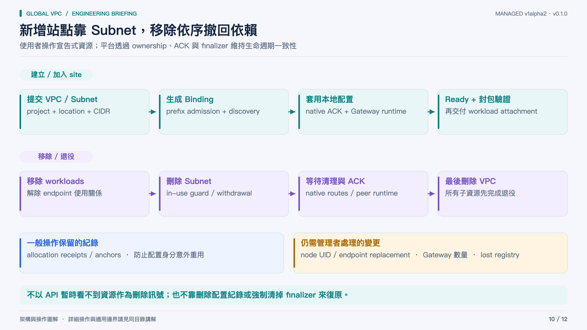

**一句話：** 不以 API 暫時看不到資源作為刪除訊號；也不靠刪除配置紀錄或強制清掉 finalizer 來復原。

**講解順序：**

1. 建立流程：使用者提交 VPC 與第一站 Subnet，本地 native 網路先成立；新增第二站 Subnet 使 VPC 有跨站需求，Authority 產生雙站 bindings，站點 discovery、native ACK 與 Gateway runtime 收斂後才回報就緒。每種 transport 都需要完整 cold join 驗收。
2. 刪除流程先移除工作負載/endpoint，再刪 Subnet。平台在有使用者或 native 資源仍在使用時阻擋不安全撤除，並等候必要的原生清理及 peer withdrawal ACK。所有子網移除後才刪 VPC。
3. 最後一個遠端前綴消失後，本地只剩 local-only VPC 時 Gateway/remote routes 可退役；本地 Vpc/Subnet 在仍有本地需求時保留。allocation receipts/anchors 不因一般 VPC 刪除自動釋放重用。
4. 刪除後同名重建有新 UID；incarnation fence 防止舊 Binding/status 被新資源接納。更換 Node UID/endpoint、調整 gatewayReplicas 或遺失 registry/key 需要明確管理者 recovery；不能描述成全自動硬體替換。
5. 驗收應區分 functional completion 與 strict zero-error；新增、刪除、重新加入均需記錄流量中斷，而非只確認最終 Ready。

**來源：** [docs/managed-quickstart.md](../../docs/managed-quickstart.md) · [internal/platformcontroller](../../internal/platformcontroller) · [internal/localcontroller](../../internal/localcontroller) · [docs/managed-validation.md](../../docs/managed-validation.md)

[4K PNG](10-network-lifecycle.png) · [可編輯 SVG](10-network-lifecycle.svg)

## 11 · 操作從 Public API 開始，排障沿權責向下追

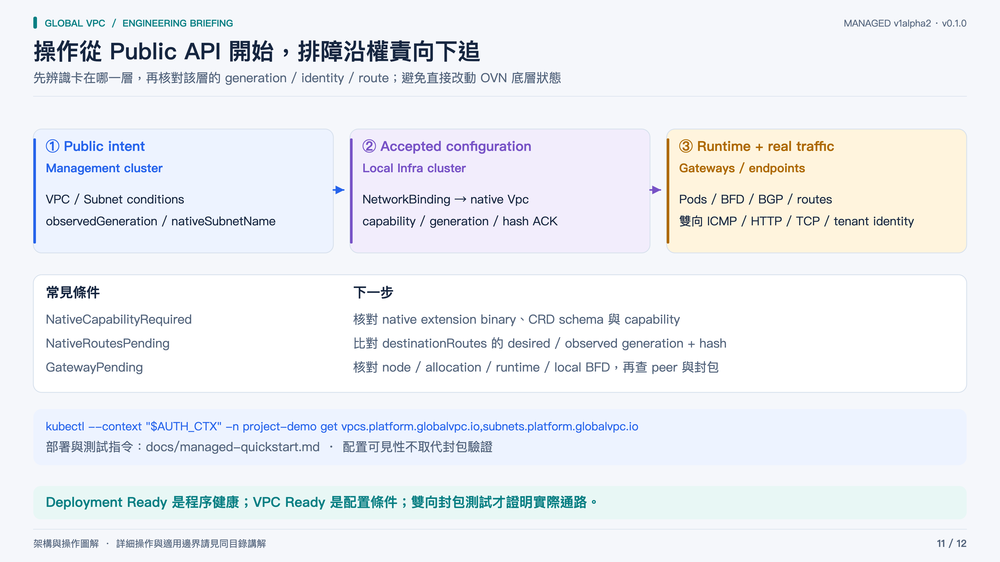

**一句話：** Deployment Ready 是程序健康；VPC Ready 是配置條件；雙向封包測試才證明實際通路。

**講解順序：**

1. 日常先看 management cluster 的 public VPC/Subnet。取得 Ready 條件、observedGeneration、Subnet.status.nativeSubnetName，再在對應 Infra 查看 local Binding 與 native CR。不要把兩個 API context 混用。
2. NativeCapabilityRequired 表示缺少支援的 native contract；核對匹配的 extension binary、schema 與 capability。NativeRoutesPending 則追 desired/observed generation 與 hash；只看 Deployment ready 無法判定路由設定是否已接受。
3. GatewayPending 往選定 node、配置分配、runtime ConfigMap、Pod readiness、本地 BFD 與 retained peer BGP/BFD 追查。Gateway Pod Ready 不包含所有 end-to-end 路徑，因此最後仍須 packet test。
4. 為避免命令混淆，圖中使用全名複數資源：vpcs.platform.globalvpc.io 是管理端 public API；Infra 的原生資源是 vpcs.kubeovn.io / subnets.kubeovn.io。完整 create/verify/delete 與 bootstrap 指令請用 managed-quickstart.md。
5. 故障復原保留 allocation receipts、UID fences 與 finalizer 原則。不要透過刪 registry、重建 key 或強制移除 finalizer 讓條件表面變綠；遇到不一致要先保存 identity 與狀態證據，再走對應 recovery。

**來源：** [docs/managed-quickstart.md](../../docs/managed-quickstart.md) · [internal/localcontroller/reconciler.go](../../internal/localcontroller/reconciler.go) · [integration/kube-ovn/README.md](../../integration/kube-ovn/README.md) · [docs/managed-validation.md](../../docs/managed-validation.md)

[4K PNG](11-operations-readiness.png) · [可編輯 SVG](11-operations-readiness.svg)

## 12 · v0.1.0：已有實作，正式採用仍需分層驗收

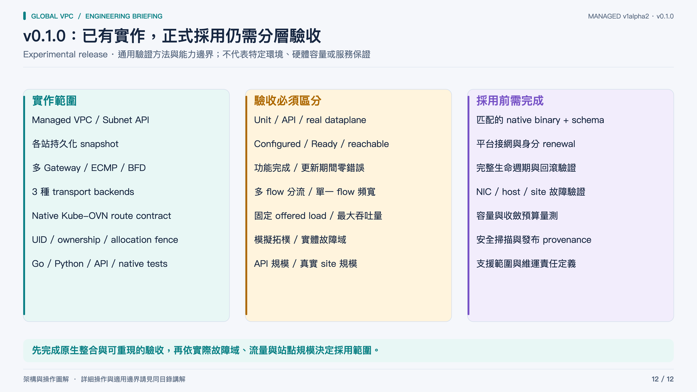

**一句話：** 先完成原生整合與可重現的驗收，再依實際故障域、流量與站點規模決定採用範圍。

**講解順序：**

1. 公開版本包含 managed VPC/Subnet API、多 Gateway、三種 transport、原生 route contract 與對應的自動測試。這些是程式能力，不等於特定部署已經通過正式驗收。
2. Unit tests、真實 API integration、native/OVSDB tests 與 dataplane tests 各自支持不同結論。模擬 runtime ACK 或注入 BFD 狀態，不是硬體故障證據。
3. 每個 transport 應核對雙向封包、來源位址、MTU、租戶隔離、成員故障與完整 join/leave/rejoin；分別記錄 functional acceptance 與 zero-error acceptance。
4. 多 Gateway 的 flow distribution、頻寬聚合與單一連線速度要分開量測。真實 site 規模還受 session mesh、物件大小、CPU 與收斂成本影響。
5. 正式採用前仍需平台接網 adapter、可更新身分、升級回滾、硬體故障域驗證、依賴掃描與發布供應鏈管理。

**來源：** [docs/managed-validation.md](../../docs/managed-validation.md) · [docs/managed-quickstart.md](../../docs/managed-quickstart.md) · [ROADMAP.md](../../ROADMAP.md) · [SECURITY.md](../../SECURITY.md)

[4K PNG](12-validation-and-boundaries.png) · [可編輯 SVG](12-validation-and-boundaries.svg)
