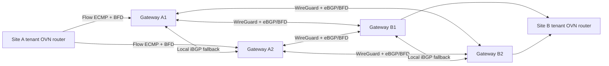

# Active-active site gateways

The D Controller supports a statically registered set of 2–8 gateways per local
attachment. Each member runs on a different Kubernetes node. All members may
forward traffic concurrently; no gateway election or shared gateway IP is used.
The live validation uses two members per site. Tenant intent remains local and
immutable, and Controllers still do not discover or call one another.
The diagram below shows the default WireGuard profile. Native Geneve/BGP and
VXLAN/EVPN profiles share the local HA lifecycle; see the
[transport guide](transport-profiles.md) for their route policy and data health.

## Forwarding and capacity

OVN selects a local gateway using explicit source/destination IP, protocol, and
transport-port hash fields. Linux uses its L4 multipath hash to choose between
FRR's equal-cost remote next hops. The same workload can therefore distribute
multiple connections across gateways and tunnels. A single flow uses one path;
this does not combine two NICs' bandwidth for a single connection. Aggregate
capacity depends on traffic distribution, encryption CPU, NICs, the underlay,
and the receiving workloads. After losing a gateway, the remaining members must
have enough spare capacity for the surviving traffic.

For `n` equal members with measured usable capacity `C`, the ideal aggregate
ceiling is `n × C`, and the single-member-failure budget is `(n − 1) × C`.
Shared bottlenecks and uneven flow hashing can lower both figures. With two
members, traffic that must keep its throughput after one failure must fit on
one member. Additional registered members can increase that failure budget;
the live experiment validates two members and does not benchmark larger sets.

Each remote gateway-pair link has its own WireGuard interface, UDP listener,
control addresses, and single authorized peer. This permits two remote gateways
to advertise the same delegated pool without competing for one interface's
AllowedIPs prefix entry. Each gateway uses its own Secret. Cleartext tenant
traffic stays inside the gateway Pod network namespace; encrypted UDP sockets
use the existing host underlay. No tenant routes are installed on ToRs.

Remote gateways in the same attachment advertise the same exact local workload
prefix. Inbound BGP filters and WireGuard AllowedIPs restrict each remote
attachment to its administrator-delegated pools. Repeated pools are permitted
only for gateways of the same registered remote attachment. Different global
VPCs retain independent OVN, namespace, key, and routing contexts.

## Failure behavior

Local OVN BFD detects unavailable gateway transit addresses and excludes their
default routes from forwarding. Remote BGP sessions use BFD to withdraw failed
tunnel paths. Both mechanisms work without a running Site Controller, while
local OVN control services and surviving routing daemons remain available.

A gateway can lose its WAN paths while its transit connection remains healthy.
Same-site gateways therefore exchange authorized remote routes using iBGP with
next-hop-self. Direct eBGP paths are preferred; the sibling is a fallback.
Remote eBGP exports only the local workload prefix, so sibling-learned remote
routes cannot turn this attachment into an unintended cross-site transit.

Conversely, a gateway can retain its WAN while losing its local OVN path. The
gateway runtime advertises its local workload prefix only while its local OVN
BFD peer is Up. It withdraws that advertisement when the local path fails.
Graceful restart is disabled for these routing neighbors so a failed path is
not retained as a stale forwarding option.

Failure detection and convergence take time. Some packets can be lost, reordered,
or delayed. TCP can recover without reconnecting when the endpoints remain
available and their timeouts tolerate the measured pause. No NAT state is stored
in these gateways, but stateful endpoint/firewall policy can impose additional
requirements. A complete site partition cannot preserve cross-site delivery.

## Explicit local ownership

| Object or field | Writer |
| --- | --- |
| Local SiteVpc and accepted plan/receipts | Site Controller |
| Local Kube-OVN Vpc/Subnet desired spec | Site Controller |
| OVN router, switches, ordinary ports, static route rows | Kube-OVN |
| Native `bfd@<vpc>` LRP and its HA chassis group | Kube-OVN via `Vpc.spec.bfdPort` |
| Dedicated BFD rows, timers, and ownership identifiers | Site Controller BFD adapter |
| BFD runtime status and route/flow convergence | Local OVN |
| `selection_fields` and its owner marker on exact owned default routes | Site Controller ECMP adapter |
| WireGuard, FRR, local health-gated route advertisement | Gateway runtime |

The BFD port must have at least two distinct configured chassis. Its active/
backup placement is for BFD control traffic, not a central tenant forwarding
gateway. BFD UUID receipts are persisted before publishing native route
references. Same-name replacement, foreign ownership, and unknown command
outcomes cannot authorize adoption or deletion.

Kube-OVN v1.16.4 does not compare a static route's `bfdId` when its route key is
unchanged. Recovery therefore withdraws a route carrying an obsolete BFD UUID,
waits for native removal, and then reintroduces it with the new UUID. Other
gateway routes remain installed. Finalization drains local endpoints, removes
gateway Pods, waits for native route withdrawal, deletes unreferenced owned BFD
rows, and removes the remaining local network objects.

HA registration also requires `bfdTransactionCommand`, an `ovsdb-client transact`
command targeting the same local NB database. Deletion checks the exact row
identity and absence of both static-route and policy references, then deletes
the rows in one atomic transaction. This closes the race between a reference
scan and deletion of a weakly referenced BFD row. The command is a local runtime
access method and is excluded from the immutable topology plan hash.

The explicit ECMP field extension is required because this Kube-OVN build's
unspecified OVN SELECT hash defaults to source IP. The adapter only changes
`selection_fields` after checking router membership, exact destination/next-hop,
the owned BFD UUID, and field ownership. Atomic OVSDB guards repeat those checks
with the update. It never creates or deletes a native static route. This boundary
is pinned to the tested Kube-OVN/OVN version and requires review before upgrades.

## Configuration and deployment

Use `config/samples/site.json` and `config/samples/site-gateway.json` together.
The Go registration supplies the gateway IDs/transit IPs and BFD source/timers;
the backend registration binds those IDs to distinct nodes, local key Secrets,
and authorized remote links. A `/29` transit subnet has space for a router and
two gateway addresses. The dedicated BFD source address must not overlap tenant
or transit networks. Reserve all address pools before disconnected operation.

Build `gateway/Dockerfile` and distribute the image to registered gateway nodes.
The runtime needs privileged Pod networking and host PID namespace access to
create the WireGuard socket in the host namespace before moving the interface.
Keep registration, Secrets, and the protected transit network under platform
administration. A local OVN NB command now requires narrow BFD writes and ECMP
field writes in addition to observation; read-only NB credentials are insufficient.

The pinned native BFD-only path can deliver a single-hop BFD packet with TTL 254
after traversing the logical router. The gateway installs an owner-guarded rule
inside its own namespace that normalizes only this exact source/destination,
UDP 3784, ingress interface, and TTL to 255 for FRR compatibility. The rule does
not alter host networking or other BFD sessions. Its counter is observable.

`LocalReady` requires at least one gateway with matching local process readiness
and Up local BFD, plus the complete intended route and ECMP-field configuration.
`GatewayRedundant` requires all configured gateways to satisfy the local checks.
Neither condition asserts remote reachability or sufficient remaining capacity.
Remote BGP/FIB observations and traffic checks are separate validation steps.

The original single-gateway registration remains supported unchanged. An already
accepted v1 attachment cannot be silently converted into v2: its immutable plan
will reject the change. Drain and recreate through the documented lifecycle.
Automatic gateway-node replacement, live membership changes, rolling gateway
upgrades, key rotation, multi-replica Controller fencing, and physical failure-domain
placement are not implemented by this change. The accepted gateway set survives a member failure;
repair or replacement of the underlying member remains an operator action.

## References

- [Pinned Kube-OVN Vpc route reconciliation](https://github.com/kubeovn/kube-ovn/blob/v1.16.4/pkg/controller/vpc.go)
- [Pinned OVN static-route BFD handling and ECMP fields](https://github.com/ovn-org/ovn/blob/caa2aa1832b7/northd/northd.c)
- [Kube-OVN dedicated BFD port patch](https://github.com/kubeovn/kube-ovn/blob/v1.16.4/dist/images/patches/e4e6ea9c5f4ba080b719924e470daa8094ff38a7.patch)
- [Kube-OVN SELECT default hash patch](https://github.com/kubeovn/kube-ovn/blob/v1.16.4/dist/images/patches/e490f5ac0b644101913c2a3db8e03d85e859deff.patch)
- [WireGuard namespace behavior](https://www.wireguard.com/netns/)
- [FRR BGP](https://docs.frrouting.org/en/latest/bgp.html) and [BFD](https://docs.frrouting.org/en/latest/bfd.html)
