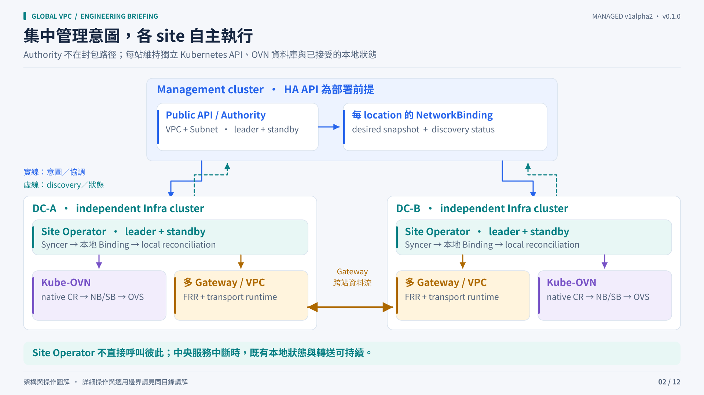

# Architecture and ownership

The management cluster stores global intent and distributes a durable, location-scoped view. Each site reconciles that view through its own Kubernetes and Kube-OVN APIs. Packet forwarding uses the selected gateways and the existing routed underlay.

## Components

| Component | Runs where | Responsibility |
|---|---|---|
| Public VPC / Subnet API | Management cluster, project namespace | Tenant intent, admission, lifecycle and observed status |
| Authority | Management cluster | Prefix admission, global IDs, authorized membership and per-location NetworkBindings |
| NetworkBinding | Management location namespace and local operator namespace | Versioned desired snapshot, explicit deletion tombstone and local status |
| Site operator / Syncer | Each Infra cluster | Persist accepted snapshots, reconcile native APIs, allocate local gateway resources and report the applied revision |
| Native Kube-OVN controller with extension | Each Infra cluster | Own destination ECMP/BFD configuration in OVN NB and acknowledge generation/hash |
| Gateway members | Selected local nodes, per VPC | FRR routing, BFD and WireGuard, Geneve or VXLAN transport |
| Existing OVN / OVS | Each Infra cluster | Local tenant forwarding, ECMP and liveness processing |

Authority and site operator manifests use two leader-elected replicas. This gives process redundancy when scheduling and API dependencies are healthy; it does not create management etcd quorum or physical site independence.

## Resource and field ownership

| Writer | Owned input or state | Must not write |
|---|---|---|
| Tenant / project automation | Public VPC and Subnet intent | Internal bindings, status, native resources or operator namespaces |
| Platform administrator | Location/class grants, reserved pools, deployment identities | Tenant runtime allocation receipts by ad hoc editing |
| Authority | Desired management NetworkBinding snapshots and public status | Remote OVN database rows |
| Site operator | Local accepted snapshots, native Vpc/Subnet intent, gateway resources and local status | Native OVN routes directly |
| Native Kube-OVN controller | Managed destination route/BFD configuration and native acknowledgement | Public VPC/Subnet admission |
| OVN northd / ovn-controller | Their normal SB / host OVS state | Global membership policy |

"One writer" applies to the managed native route configuration. It does not mean that northd and ovn-controller stop managing their own normal state.

## Automatic membership without an extra directory

1. An administrator labels eligible gateway Nodes and reserves infrastructure pools.
2. The site operator records member identity, node UID, endpoint and allocation receipts.
3. Public discovery data is reported in the management NetworkBinding status. WireGuard private keys remain in local immutable Secrets.
4. The authority includes authorized participants of that VPC in each location's next snapshot.
5. Local operators persist accepted snapshots, create the corresponding links and acknowledge the applied revision.

The existing management Kubernetes API is the logical directory. There is no separate directory database or site-controller RPC mesh. A missing list item or temporarily unreachable API is not a deletion instruction: withdrawal uses an explicit lifecycle and tombstone.

## Sparse and broad membership

Only locations with relevant VPC membership receive its peer information. A VPC joining a few sites does not connect every registered site. Broad membership still increases peer/link state: for symmetric `S` participating sites and `G` members per site, the cross-site member-pair count is `S × (S − 1) × G² / 2`. At 50 sites and G2 that is 4,900 pairs.

This is topology arithmetic, not a capacity qualification or an exact interface count for every backend. [Validation](validation.md) separates API storage experiments from real gateway convergence and packet scale.

## The physical boundary

Place gateway members on separate physical hosts when host redundancy is required. Two Pods on two VMs sharing one host do not survive that host's loss. Each site's OVN database, control-plane availability, underlay, power and failure-domain placement remain deployment responsibilities.
