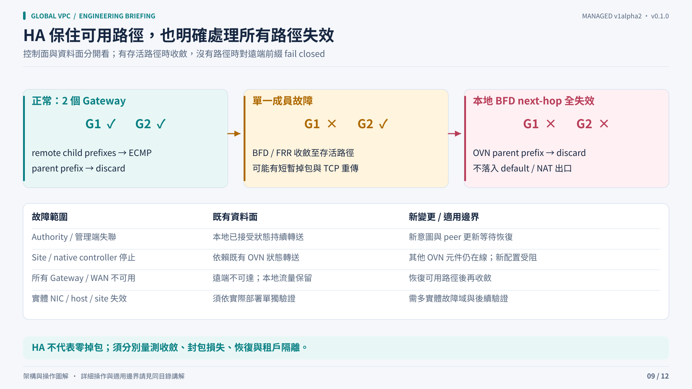

# Availability and recovery

Separate existing forwarding from accepting new intent. Gateways and OVN can keep forwarding from accepted state during bounded controller outages, while new global changes depend on the management service returning.

## Failure behavior

| Failure | Intended behavior | What remains dependent |
|---|---|---|
| One authority replica | Leader election can select the other replica | Healthy management API and quorum |
| Authority process or management access unavailable | Retain accepted local snapshots and existing forwarding | New global admission, peer updates and status reporting wait |
| Site operator stopped | Existing gateway runtime and installed OVN routes continue | New local reconciliation and runtime changes wait |
| Native Kube-OVN controller stopped | Existing OVN dataplane remains | New native route acknowledgements wait; this is not OVN DB loss |
| One gateway path/member fails | BFD/route convergence selects surviving paths | Sufficient surviving local and remote capacity |
| Every remote WAN path fails | Remote destination unavailable, local isolation retained | Underlay recovery |
| Every local destination BFD path fails | Parent destination discard prevents default/NAT escape | A healthy route path must return |
| Physical host, rack or site fails | Requires real failure-domain placement and testing | Requires hardware-specific qualification |

Fault convergence and configuration updates can cause packet loss or response gaps. This project does not provide a zero-loss failover SLA.

## Durable snapshots

A snapshot is accepted with identity, source generation and revision fences. The local copy survives a management interruption. API list omission is not interpreted as deletion, and the controller does not clear accepted state just because the directory cannot be reached.

Deletion carries explicit intent and waits for required native cleanup and withdrawal acknowledgements. Same-name recreation has a new UID and must not consume an old incarnation's status.

## Runtime updates

Gateway runtime ConfigMaps are immutable and identified by configuration, image and source hashes. At most one member is replaced for a generation update. Surviving members must satisfy local native BFD and direct retained-peer BGP/BFD/FIB checks; a sibling backup route is insufficient proof of a direct path.

A remote outage can therefore block a configuration rollout while the accepted dataplane continues. This favors preserving known forwarding state over pretending an unsafe rollout succeeded.

## Recovery is deliberately fenced

Registry loss/replacement, missing published keys, changed Node UID/endpoint and gateway replica-count changes require an explicit administrative recovery procedure. Allocation receipts and immutable anchors are retained after teardown. Deleting these records or force-removing finalizers is not a supported repair.

Back up management intent, allocation registries/anchors, local accepted state and required private-key material under your existing protected Kubernetes backup policy. Protect identities and access during restore; restoring object content alone does not prove that UID/ownership fences will accept it. Qualify recovery on a disposable environment before relying on a production runbook.

## Management HA is a prerequisite

Two controller replicas do not replace etcd quorum. This project does not choose a multi-DC Kubernetes control-plane topology. With only two physical failure domains, majority-based state cannot remain writable after loss of either domain without an additional independent quorum design. Keep management disaster recovery and tenant forwarding availability as separate acceptance criteria.
