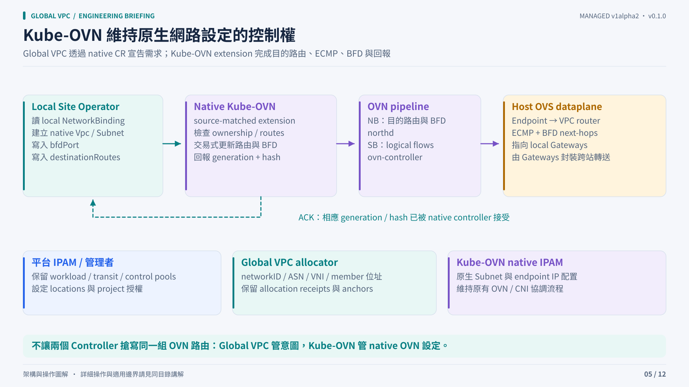

# Integrating with Kube-OVN

Global VPC declares native resource intent; Kube-OVN remains responsible for its OVN route configuration. Cross-location operation requires the source-matched `destination-routes.v1` extension and its CRD schema.



## The reconciliation contract

The local operator projects accepted bindings into native `Vpc` and `Subnet` objects, including `Vpc.spec.bfdPort` and `Vpc.spec.destinationRoutes`. The native extension validates destination scopes and ownership, commits route/BFD changes, then reports:

```yaml
status:
  destinationRoutes:
    capability: destination-routes.v1
    observedGeneration: 7
    appliedHash: <desired SHA256 hash>
    ready: true
```

The local operator requires the capability, current generation, expected hash and readiness together. An installed schema, an existing native object or a healthy Deployment is insufficient evidence of route application. This acknowledgement also does not prove transport health or end-to-end delivery.

## Fail closed for the intended destination

For an example remote `10.70.0.0/24`, the native extension installs BFD-protected ECMP groups for `10.70.0.0/25` and `10.70.0.128/25`, plus a parent `/24` discard route. Healthy child routes win by longest-prefix match. If all their next hops become unavailable, the parent discard prevents fallthrough to an unrelated default/NAT exit.

For `N` gateway next hops this requires `2 × N + 1` static-route rows per destination. BFD sessions can be shared by the native BFD-port/next-hop tuple when timers agree. Existing source-policy routes or policy reroutes must not override protected destinations; the guarantee is scoped to that routing contract.

## Version matching is part of installation

Follow the [native extension installation guide](../../kube-ovn-extension-install.md)
before the managed quick start. It includes exact source selection, patch/build
commands, matching image packaging, additive CRD dry-run/apply, all-replica
replacement, generation/hash verification and drained rollback.

| Build | Source target | Evidence boundary |
|---|---|---|
| Upstream-oriented extension | Pinned Kube-OVN v1.16.4 source | Patch, native tests and build path; deploy and qualify against your exact baseline |
| Compatibility extension | Pinned v1.16.3 controller source | Preserves this source target's dependencies and recovery behavior; qualify against the target deployment |

Controller, central, CNI and OVS versions can differ in a deployment. A similar version label does not establish compatibility. Review the [full native extension contract](../../../integration/kube-ovn/README.md), source locks, schema and binary as one change. Stock upstream Kube-OVN does not implement this project's exact destination-route contract.

A local-only VPC can create native Vpc/Subnet resources without this cross-location extension. The two-location quick start requires it.

## IPAM and compute integration

| Layer | Owner |
|---|---|
| Parent workload and infrastructure reservations | Existing platform IPAM / administrator |
| Global network IDs, ASNs and native transport IDs | Authority's retained allocation state |
| Gateway transit, health, link address and port receipts | Local operator's retained registry and immutable anchors |
| Endpoint addresses inside native Subnets | Native Kube-OVN IPAM |

A compute adapter should resolve `Subnet.status.nativeSubnetName` before attaching an endpoint in the correct Infra cluster. That adapter and a tenant UI are not implemented in v0.1.0. The repository's smoke Pod example demonstrates the resolved attachment for evaluation.

## This is not the built-in OVN-IC path

The managed design does not require shared cross-site OVN databases or adoption of the default VPC. It uses separate tenant contexts and explicit gateway routing. Legacy OVN-IC implementation and experiments remain historical material; use the managed manifests for this release.
