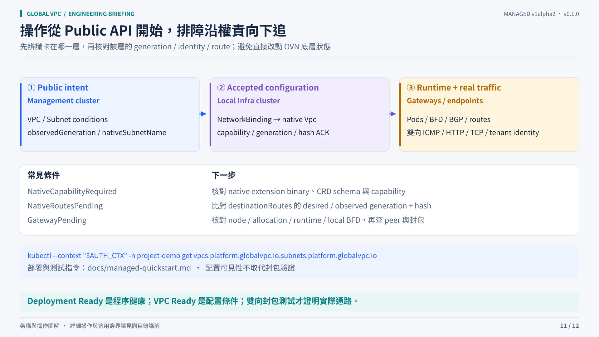

# Operating a managed VPC

Start with the public resource, then follow the acknowledgement chain into the relevant Infra cluster. A process-ready Deployment, a configuration-ready VPC and working packets are three different observations.



## Inspect intent and attachment

```sh
kubectl --context management -n project-demo get vpcs.platform.globalvpc.io,subnets.platform.globalvpc.io
kubectl --context management -n project-demo describe vpc.platform.globalvpc.io production
kubectl --context management -n project-demo get subnet.platform.globalvpc.io app-a \
  -o jsonpath='{.status.nativeSubnetName}'
```

Replace context and namespace values with your installation. Resolve the native subnet name in the management API, then inspect its native resources in the matching Infra cluster. Do not confuse public `vpcs.platform.globalvpc.io` with native `vpcs.kubeovn.io`.

## Diagnose the stalled layer

| Observation | Check next |
|---|---|
| Public intent rejected or pending | Project/location grants, CIDR pool membership, overlap, immutable network class and current object UID |
| Binding revision not applied | Location identity, management access, local accepted revision and generation |
| `NativeCapabilityRequired` | Source-matched native controller binary, schema and `destination-routes.v1` capability |
| `NativeRoutesPending` | Native observed generation and desired/applied hash, then native controller logs |
| `GatewayPending` | Selected node identities, allocation receipts, immutable runtime generation, Pod state and local BFD |
| VPC Ready but traffic fails | Direct peer BGP/BFD/FIB, remote native path, endpoint attachment, UDP reachability and MTU |

Do not directly patch managed OVN rows to make status green. Preserve owner UIDs, revisions, condition messages and relevant logs before recovery.

## Validate actual packets

The [quick start](../../managed-quickstart.md#install-dc-b-then-extend-the-existing-vpc) renders smoke Pods with the resolved native subnet names and runs bidirectional packet checks after a local DC-A check. Include source-address, cross-tenant isolation and DF/MTU checks in your environment's acceptance plan. A passing ping alone does not establish throughput or every protocol path.

## Add or remove a location

Add a public Subnet for the same VPC with an authorized `locationRef` and a non-overlapping CIDR. The platform generates membership and gateway state. A single-location VPC does not create cross-location gateways until remote prefixes exist.

For removal, delete workloads/endpoints first, then the Subnet. Wait for in-use guards, native cleanup and peer withdrawal acknowledgement. Delete the VPC after its child Subnets are gone. A rejoined same-name object has a fresh UID.

## Credentials and updates

The bootstrap helper issues short-lived development access. Before expiry, generate a fresh private kubeconfig, update the local access Secret and restart the site operator: inline tokens are loaded at startup. Automated issuer integration and credential renewal are not implemented.

Use immutable controller and gateway image digests. Changes to the source-matched Kube-OVN binary and its schema require separate compatibility review, rollback preparation and packet validation. The `v1alpha2` API has no guaranteed upgrade/migration contract.

## Observability boundary

Kubernetes conditions, events/logs, native acknowledgements and gateway routing/BFD inspection are the primary tools supplied here. This release does not provide a production alert catalog, SLO dashboard pack or support SLA. Build alerts around stale observed generations, failed acknowledgements, unavailable gateway members and credential renewal in the surrounding platform.
