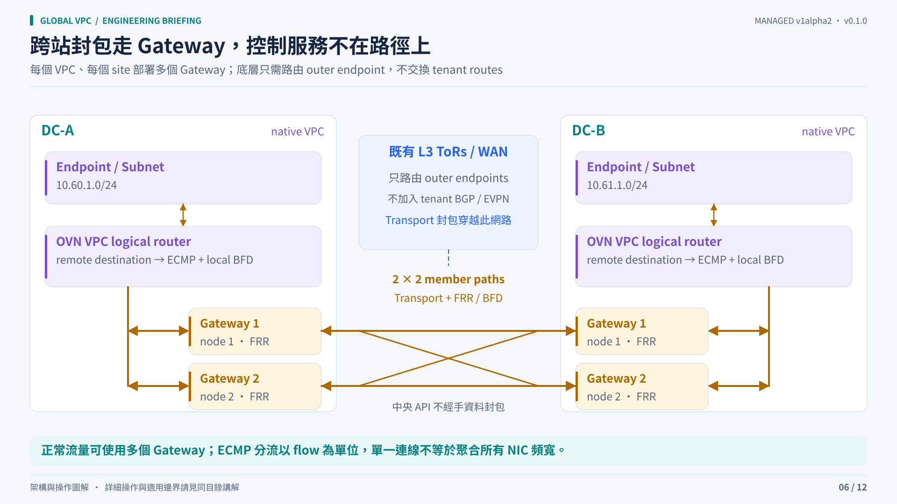

# Packet path and transport choices

All profiles use the same public VPC/Subnet API and automatically managed gateway membership. The network class is an administrator-approved choice and is immutable for an existing VPC.

## Follow one packet

1. The source endpoint enters its local native Kube-OVN VPC router.
2. A destination-specific ECMP group chooses a healthy local gateway next hop.
3. The gateway forwards through the selected tenant transport over routable outer node endpoints.
4. A remote gateway decapsulates and forwards into its local native VPC.
5. The destination endpoint receives the original workload traffic.

The management authority and site operators do not carry these packets. Local OVN-to-gateway BFD and inter-gateway FRR/BFD observe different failure scopes. The routed IPv4 path is designed to preserve workload source addresses; verify this in endpoint packet captures.

## Profile comparison

| Class in examples | Transport | UDP requirement | Encryption | Operational trade-off |
|---|---|---|---|---|
| `default` | WireGuard / BGP | Reserved per-node range, example 20000–29999 | Yes | Key lifecycle and encryption CPU/MTU cost; local immutable private keys |
| `trusted-geneve` | Geneve / BGP | 6082 | No | Simpler trusted-underlay option; VNI and source-delegation ownership must remain correct |
| `trusted-evpn` | VXLAN / EVPN | Control 4788, data 4789 | No | Tenant VRF/L3VNI and FRR EVPN Type-5 model; more control-plane state to diagnose |

OVS Geneve UDP 6081 remains reserved for the existing Kube-OVN dataplane. Native Geneve and VXLAN profiles require a trusted private underlay; isolation is not transport encryption.

## What “unchanged ToRs” means

The gateways implement the overlays and routing protocol. ToRs route outer endpoint IPs and do not need tenant VLANs, tenant VNIs, per-VPC route advertisements, EVPN participation or gateway BGP peering. Existing IP reachability, permitted UDP and a sufficient end-to-end MTU are still prerequisites.

Gateway control sessions currently use cross-site eBGP with local sibling iBGP fallback. The platform allocates ASNs; tenants do not configure them. This implementation choice is not a claim that every multi-site VPC design requires eBGP.

## Multiple gateways and bandwidth

The example topology has two members per location per VPC. Independent flows can use different paths; one flow does not automatically aggregate every NIC's bandwidth. Hardware port sums, such as eight hosts with two 25 Gb/s NICs, are not measurements of effective tenant throughput.

Gateway CPU, crypto, packet size, MTU, local OVN capacity, WAN capacity and hashing all matter. Higher member counts and bandwidth aggregation require separate qualification. Replica-count or node UID/endpoint replacement is fenced and requires an explicit administrative recovery workflow in this version.

## MTU and migration

The example uses MTU 1380. Validate the complete encapsulation budget against your underlay and workload path rather than assuming the example is universal. Include IPv4 DF checks; the explicit MTU setting is not automatic path-MTU sizing.

Changing an existing VPC's profile is rejected. Create a new VPC, plan endpoint/address migration and validate the new path separately.
